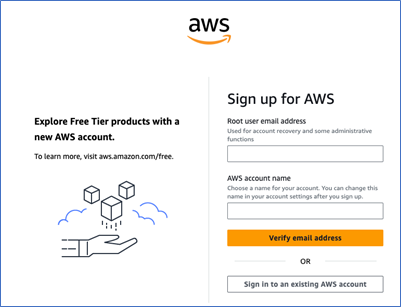
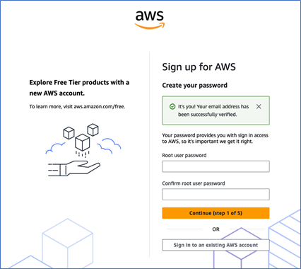
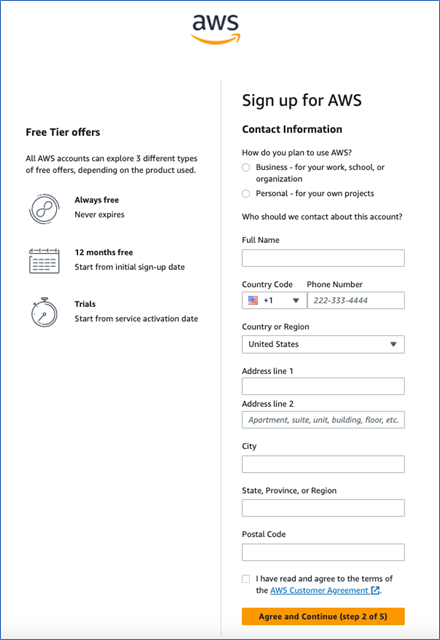
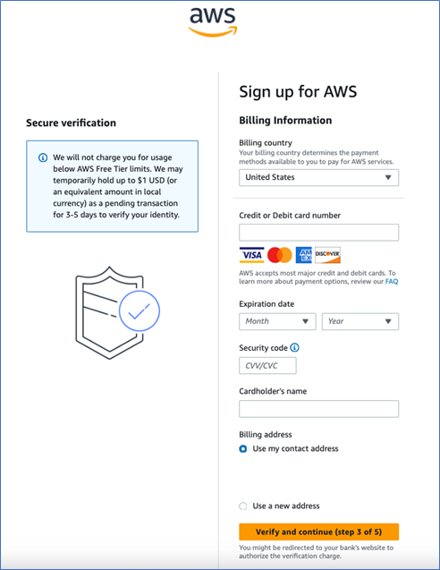
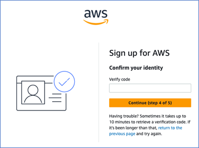
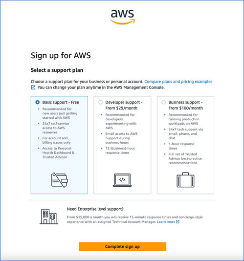
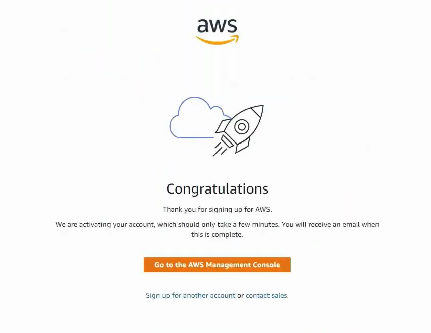
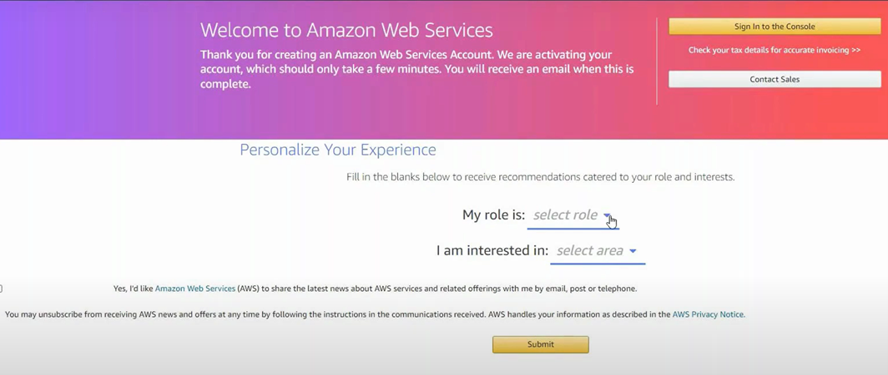

**Getting started with AWS Cloud**

**Table of Contents**
- [Overview](#overview)
- [Getting Started with AWS](#getting-started-with-aws)
  - [Sign Up](#sign-up)
    - [Email Verification and Password Setup](#email-verification-and-password-setup)
    - [Add Contact Information](#add-contact-information)
    - [Add Billing Information](#add-billing-information)
    - [Confirm Your Identity](#confirm-your-identity)
    - [Select a Support Plan](#select-a-support-plan)
    - [Personalize Your Account](#personalize-your-account)
- [Frequently Asked Questions (FAQs)](#frequently-asked-questions-faqs)

# Overview
Amazon Web Services (AWS) is an online computing platform. This platform enables you to work efficiently without relying on high-end physical hardware. AWS provides various services such as Amazon EC2, Amazon Simple Storage Service (S3), Amazon VPC, and Amazon RDS. AWS helps you host simple websites to run complex big data applications and machine learning workloads. This guide helps you to get started with AWS.

**Benefits**
* **Easy to use:** Enables you to host and manage applications quickly and easily.
* **Flexible:** Provides you scalability based on your needs.
* **Reliable:** Provides you with backup and failover.
* **Secure:** Uses security features to protect your data and applications.
* **Cost-effective:** Enables you to pay only for the resources you use.

**Key system requirements**

* **Web browser:** The latest version of Google Chrome, Mozilla Firefox, Microsoft Edge, or Safari is required for accessing the AWS Management console.
* **Internet connection:** A stable and fast internet connection is recommended, as AWS is a cloud-service.
* **Operating system:** AWS is compatible on most modern operating systems including Windows, macOS, and Linux.

# Getting Started with AWS

AWS provides extensive cloud computing services with a pay-as-you-go model. This guide helps you create an AWS account and personalize your experience.

## Sign Up

Sign-up for AWS includes the following steps:

1. Email verification and password setup
2. Add contact information
3. Add Billing Information
4. Confirm your identity
5. Select a support plan
6. Personalize your account

**Prerequisites**
* Email address
* Phone number
* User name and address
* Credit/Debit card

### Email Verification and Password Setup
1. On your desktop/laptop, open the AWS website.
2. On the left pane, select **Create a new AWS account**.
3. On the Sign-up page, perform the following steps:

    a. In the **Root user email address** field, enter the email address you want to use to manage your AWS account.

    **Note:** The root user is the administrator for the AWS account.

    b. In the **AWS account name** field, enter your desired account name.

    c. Select **Verify email address**. 
    
    A verification code is sent to your email address.

    

    d. In the **Verification code** field, enter the verification code.

    e. Select **Verify**.

    Your email address is verified.

    f. In the **Create your password** page, perform the following steps:

    i.   In the **Root user password** field, enter your desired account password.

    ii.  In the **Confirm root user password** field, reenter the password.

    iii. Select **Continue (step 1 of 5)**.

    

    The **Contact Information** page is displayed.

### Add Contact Information
1. On the **Contact Information** page, perform the following steps:

    a. For the **How do you plan to use AWS** question, select one of the following options:

    * Select Business - for your work, school, or organization.
    * Select Personal - for your own projects.

    b. In the **Who should we contact about this account** section, enter your contact information.

    c. Select **AWS Customer Agreement** and read it carefully.

    d. Select the check box and select **Continue (step 2 of 5)**.

    

    The **Billing Information** page is displayed.

### Add Billing Information

1. On the **Billing Information** page, perform the following steps:

    a. In the **Billing Information** field, enter your desired credit/debit card details for AWS payments.

    b. In the **Billing address** section, select one of the following options:

    * Select **Use my contact address** to use the address provided on the contact information page during billing.
    * Select **Use a new address** to add a different address during billing.

2. Select **Verify and continue (step 3 of 5)**.

An OTP is sent to your registered mobile number for card verification, and you are redirected to the bank’s OTP verification page.

**Note:** A refundable amount is charged and automatically refunded after verification.

3. On the bank’s OTP verification page, enter the OTP.

4. Select **SUBMIT**.

The Confirm your identity page is displayed.

### Confirm Your Identity

1. On the **Confirm your identity** page, perform one the following options:

    * Using Text message

        i. In the **How should we send you the verification code?** section, select **Text message (SMS)**.

        ii. Select your country code and enter your mobile number.

        iii. Enter the captcha code displayed.

        iv. Select **Send SMS (step 4 of 5)**.

        A verification code is sent to the mobile number.

        v. In the **Verify code** field, enter the verification code.

        vi. select **Continue (step 4 of 5)**.

        

    * Using Voice call

        i. In the **How should we send you the verification code?** section, select Voice call.

        ii. Select your country code and enter your mobile number.

        iii. Enter the captcha code displayed.

        iv. Select **Call me now (step 4 of 5)**.

        A verification call from AWS is made to the mobile number.

        v. In the **Verify code** field, enter the verification code received through the call.

        vi. select **Continue (step 4 of 5)**.

        

    The Select a support plan page is displayed.

### Select a Support Plan

1. On the **Select a support plan** page, select your desired plan.

    **Note:** You can change your plan anytime in the AWS Management console.

2. Select **Complete sign up**.

    

    Your support plan is selected and the Congratulations page is displayed.

### Personalize Your Account

1. On the **Congratulations** page, select **Go to the AWS Management Console**.

2. On the **Welcome to Amazon Web Services** page, perform the following steps:

    a. From the **select role** drop-down, select your desired role.

    b. From the **select area** drop-down, select your area of interest.

    c. Select **Submit**.

    

    Your account is personalized, and AWS suggests services based on your interests and preferences.

You have successfully signed up for an AWS account. You can start exploring and using AWS services to build, deploy, and manage your applications based on your requirements.

# Frequently Asked Questions (FAQs)

**What is AWS?**

Amazon Web Services (AWS) is a cloud computing platform that provides a range of services such as computing power, storage, and databases.

**Is AWS free to use?**

AWS offers some free services, but not all of them are free.

**How do I create an AWS account?**

You can create an AWS account by visiting the AWS website and signing up with your email, contact details, and a valid payment method.

**Do I need to install AWS on my computer?**

No, AWS is a cloud-based service. You can access AWS using your browser.

**What is a Root user?**

The Root user in AWS is the original account owner with full administrative access.

**Do I need a credit card to create an AWS account?**

Yes, AWS requires a credit or debit card to verify your account.

**Can I store files in AWS?**

Yes, you can store files securely using Amazon S3.

**How can I learn AWS?**

You can learn AWS using AWS documentation and AWS Training & Certification modules available on the AWS website.
